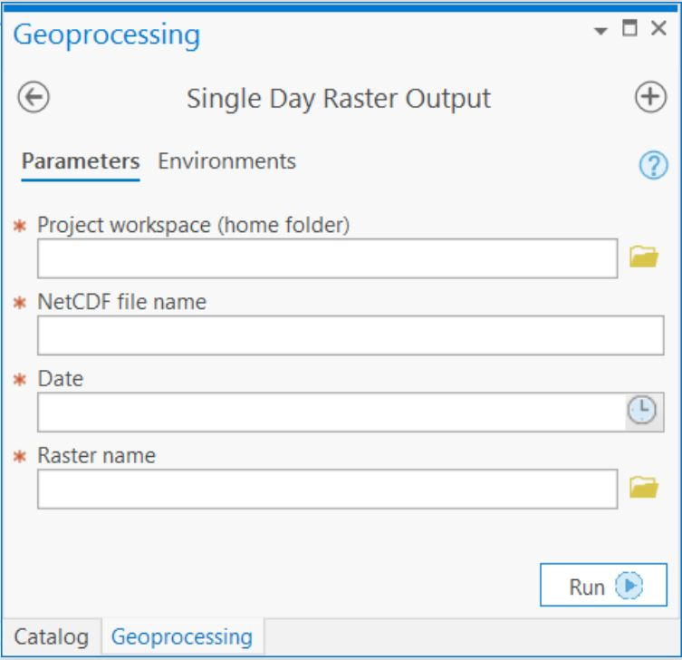
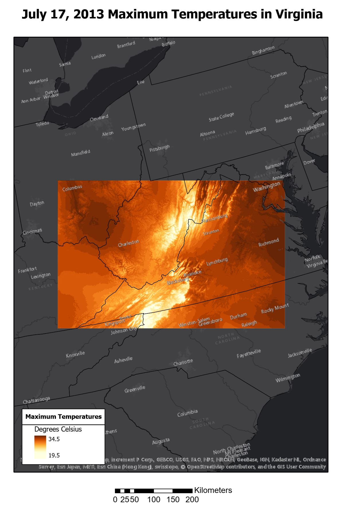
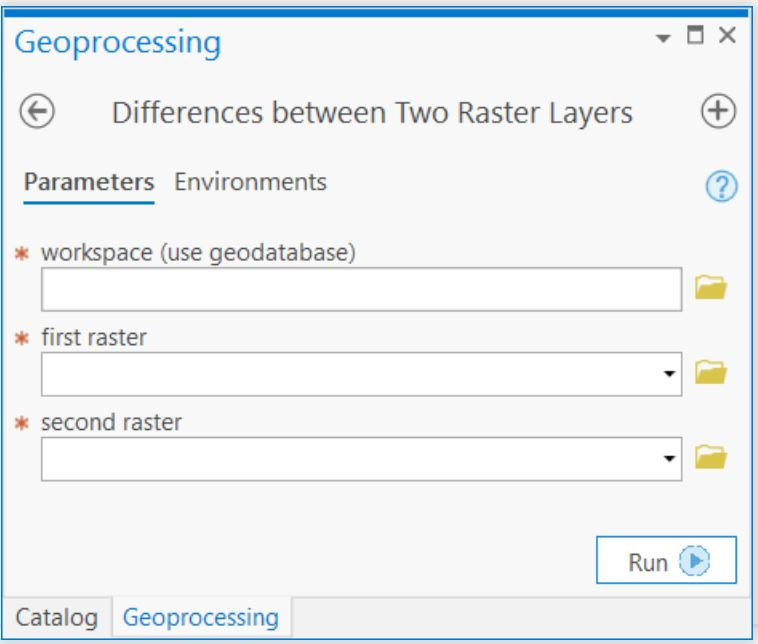
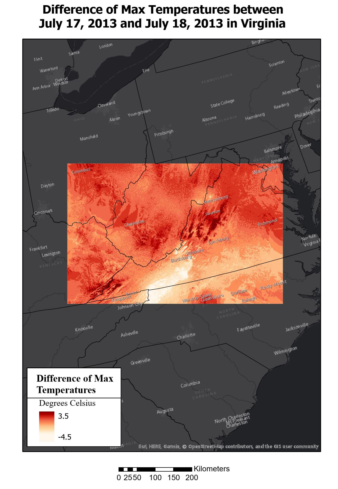
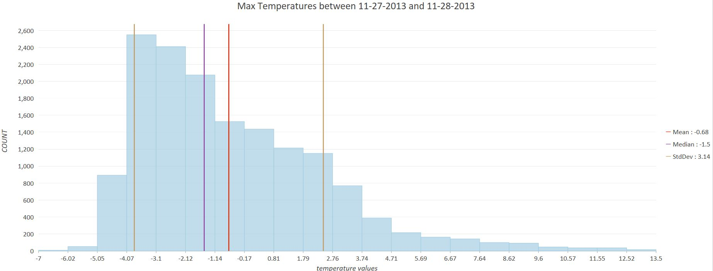

# Raster GRID Processing
This project contains two script tools in ArcGIS Pro that pertain to raster GRID processing for netCDF climate data.  The data used contains yearly max temperatures for Virginia.     

* The first tool reads and converts the netCDF data into a single day's raster layer of max temperatures. 

* The second tool analyzes the data by creating an ArcGIS Pro chart of the frequencies of temperature differences from two previous rasters from the first tool.

### Raster creation tool objectives:
1. Collect parameters from user in ArcTool interface:
    * date of data user wants (year, month, and day)
    * .nc file name
    * name of raster user wants
2. Create GRIDFLOAT (.flt) file and save it in organized file structure.
3. Add the new .flt file to ArcGIS Pro map.

#### Tool interface

#### Map displaying tool output

### Raster analysis tool objectives:
1. Collect parameters from user in ArcTool interface:
    * name of raster from first run of tool #1
    * name of raster from second run of tool #1
2. Convert both rasters to Numpy Arrays and calculate differences.
3. Create a histogram of the differences using ArcGIS charts.

#### Tool interface

#### Map displaying tool output

#### Histogram example

